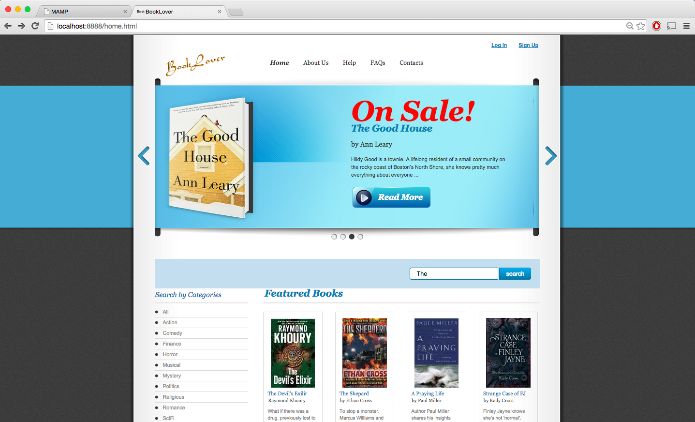
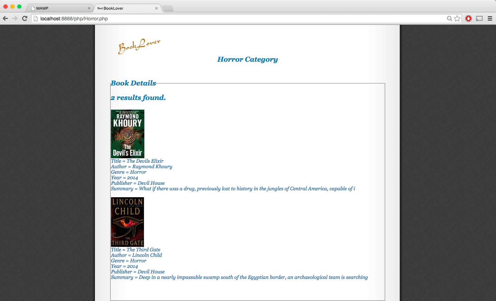
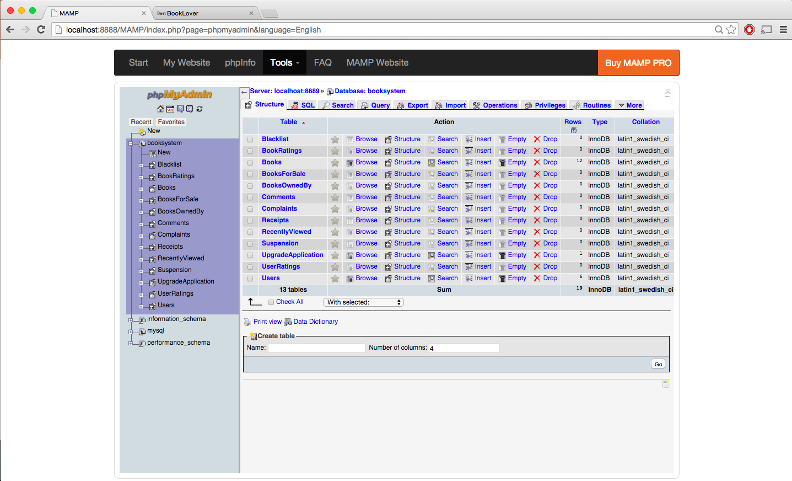
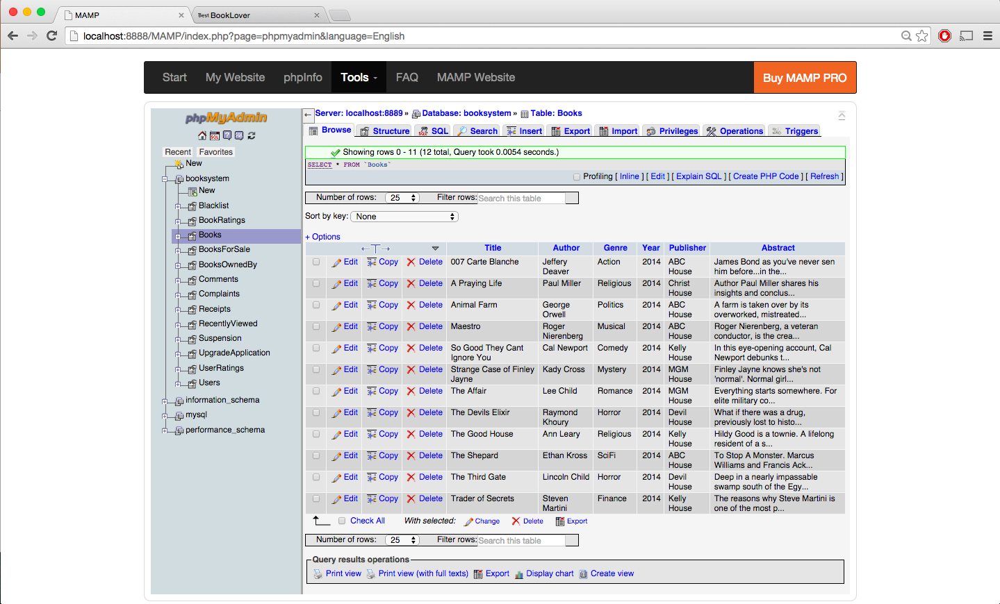

# Bookstore-Management-System
A MAMP bookstore management system where buyers can register for an account, search books, and buy books. Sellers can sells books, and manage the inventory of the books.

### Technologies
  HTML/CSS/Javascript
  
  MAMP (My Apache, MySQL, PHP)

### Overview
Our system has four types of users: Visitors, Registered Users, Sellers, and Super Users. Users can only browse and search books, while registered users can buy books and sellers can buy and sell books. In addition, registered users can rate, comment, complain on books and sellers. Both the registered users and sellers are managed and administered by the supers users. Super users can upgrade a register user to seller, blacklist a seller, cancel an account, etc.

Homepage of the system. Users can log in or sign up to buy or sell books. 

Results of serach by category: 'Horror'.

MAMP database system managed by super users. 

Database of the books currently in the system.

### Credits
[Tenzin Chhosphel](https://www.linkedin.com/in/tenzin15), Santiago Salas, Brandon Chin.

